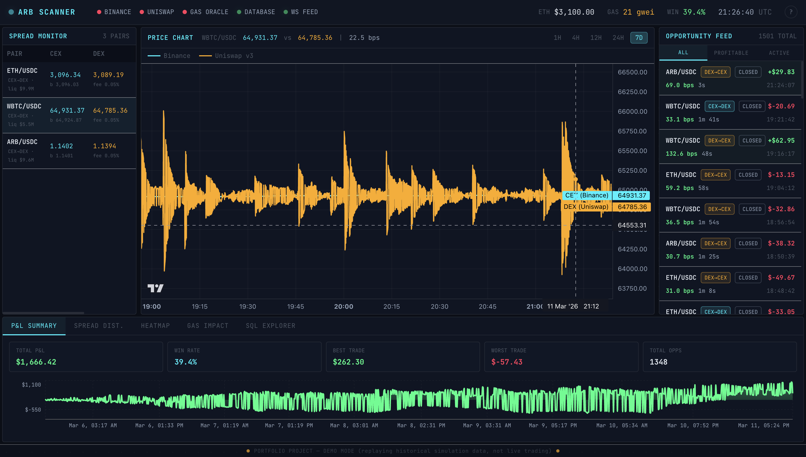

# ARB Scanner

A real-time arbitrage dashboard that watches price differences between Binance and Uniswap v3, flags profitable spread windows, and logs every signal with a full cost breakdown. I built it mainly to have something concrete to show for the PostgreSQL analytics and async Python work I've been doing — the SQL queries are the real centrepiece here.



Tracks three pairs (ETH/USDC, WBTC/USDC, ARB/USDC). Runs entirely in Docker. Seeds a week of simulated price history automatically so everything works on first boot without any API keys.

## Getting started

```bash
git clone https://github.com/your-username/arbitrage-analyzer.git
cd arbitrage-analyzer
cp backend/.env.example backend/.env
docker-compose up --build
```

Open http://localhost:3000. That's it.

Demo mode seeds seven days of GBM-simulated price data on startup — all the charts, heatmaps, and analytics work immediately. If you want live prices, drop a TheGraph API key and Etherscan key into `backend/.env` and restart.

## Stack

Python 3.11, FastAPI, asyncpg, PostgreSQL 15 on the backend. React 18 + TypeScript + Tailwind on the frontend. TradingView's lightweight-charts for the price chart, Recharts for analytics, Monaco Editor for the SQL explorer. Everything wired together with Zustand and TanStack Query. GitHub Actions for CI.

## The SQL

All the analytics queries live in `backend/app/queries/sql_queries.py` as raw strings — no ORM. This was intentional. Here are the four I'm most happy with:

**Rolling spread average**

The spread series itself is built with a `LATERAL` join that finds the closest-in-time DEX tick for each CEX tick (the two feeds are asynchronous, so you can't just join on timestamp). Then two window frames in one pass — 60 rows back for the 5-minute average, 720 for the 1-hour:

```sql
AVG(spread_bps) OVER (
    ORDER BY recorded_at
    ROWS BETWEEN 60 PRECEDING AND CURRENT ROW   -- ~5 min at 5s intervals
) AS rolling_5min_avg_bps,
AVG(spread_bps) OVER (
    ORDER BY recorded_at
    ROWS BETWEEN 720 PRECEDING AND CURRENT ROW  -- 1 hour
) AS rolling_1hr_avg_bps
```

**Profitability percentiles**

`PERCENTILE_CONT` is underused. This computes P25/P50/P75/P95 of net profit grouped by pair and direction in a single query. The `WITHIN GROUP (ORDER BY ...)` syntax looks odd the first time but makes sense once you think of it as sorting before aggregating:

```sql
PERCENTILE_CONT(0.25) WITHIN GROUP (ORDER BY ao.net_profit_usd) AS p25,
PERCENTILE_CONT(0.50) WITHIN GROUP (ORDER BY ao.net_profit_usd) AS median,
PERCENTILE_CONT(0.95) WITHIN GROUP (ORDER BY ao.net_profit_usd) AS p95
FROM arbitrage_opportunities ao
JOIN token_pairs tp ON tp.id = ao.pair_id
GROUP BY tp.symbol, ao.direction
```

**Gas break-even analysis**

Two CTEs feeding a `CROSS JOIN` to produce a matrix — minimum spread to break even at different trade sizes and gas price scenarios. The `unnest(ARRAY[...])` trick for generating the size rows is the kind of thing that saves you from creating a temp table or making six separate queries:

```sql
WITH gas_percentiles AS (
    SELECT
        PERCENTILE_CONT(0.50) WITHIN GROUP (ORDER BY estimated_swap_cost_usd) AS p50_gas,
        PERCENTILE_CONT(0.90) WITHIN GROUP (ORDER BY estimated_swap_cost_usd) AS p90_gas
    FROM gas_prices
    WHERE recorded_at >= NOW() - INTERVAL '24 hours'
),
trade_sizes AS (
    SELECT unnest(ARRAY[1000, 5000, 10000, 25000, 50000]) AS size
)
SELECT
    t.size,
    ROUND((g.p50_gas / t.size * 10000 + 20)::NUMERIC, 2) AS breakeven_median_gas_bps
FROM trade_sizes t
CROSS JOIN gas_percentiles g
```

**Cumulative P&L**

The equity curve — `SUM OVER` with `UNBOUNDED PRECEDING` partitioned by pair gives you a running total per pair ordered by time. Simple but it's a good example of window functions doing something you'd otherwise need a self-join or application-side loop to pull off:

```sql
SUM(ao.net_profit_usd) OVER (
    PARTITION BY ao.pair_id
    ORDER BY ao.opened_at
    ROWS BETWEEN UNBOUNDED PRECEDING AND CURRENT ROW
) AS cumulative_pnl
```

There are three more in the file — opportunity clustering with LAG/LEAD, a heatmap using EXTRACT(ISODOW), and a spread histogram using `width_bucket`. All runnable live from the SQL Explorer tab in the dashboard.

## How the detection works

The engine polls latest CEX and DEX prices every three seconds. Spread is `|cex - dex| / min(cex, dex) × 10,000` — basis points normalize it across different asset price levels so a 30 bps threshold means the same thing for ETH at $3,000 and ARB at $1.

An opportunity opens when spread ≥ 30 bps and closes when it falls back below 10 bps. The hysteresis gap (10 vs 30) prevents the engine from opening and closing the same opportunity every tick during a volatile period.

Net profit deducts four things from gross: the Uniswap pool swap fee (5 bps for the 0.05% tier), Binance's taker fee (10 bps), estimated on-chain gas (`(base_fee + priority_fee) × 150k gas units × ETH/USD`), and AMM slippage. The slippage model is a linear approximation — `min(0.5%, trade_size / pool_liquidity × 0.5)` — conservative but reasonable for small trades in deep pools. CEX execution is off-chain so only one on-chain transaction (the DEX leg) is needed.

The trickiest part to calibrate was making the seeded demo data realistic. Win rate of 100% looks wrong to any finance person immediately. The seed script now uses an exponential spread distribution (`30 + Exp(mean=32 bps)`) with gas drawn from `Uniform($20, $56)`, which works out to roughly 40% win rate and a few thousand dollars total P&L over seven days — plausible for a small-size systematic strategy.

## Structure

```
arbitrage-analyzer/
├── db/
│   └── init.sql              # schema, indexes, refresh_daily_analytics()
├── backend/
│   ├── app/
│   │   ├── services/         # Binance WS feed, Uniswap poller, gas tracker, arb engine
│   │   ├── routers/          # REST endpoints + /ws/live WebSocket
│   │   └── queries/
│   │       └── sql_queries.py
│   ├── seed_data.py          # 7-day GBM price simulation
│   └── tests/
├── frontend/
│   └── src/
│       ├── components/       # SpreadMonitor, PriceChart, OpportunityFeed, AnalyticsTabs
│       ├── hooks/            # useWebSocket (auto-reconnect), useApi (TanStack Query)
│       └── store/            # Zustand
└── docker-compose.yml
```

The frontend is a single-page app. No routing. State is split between Zustand for live WebSocket data and TanStack Query for REST with caching. The SQL Explorer tab lets you run any read-only query directly against the database — I used it constantly while tuning the seed data.

REST endpoints are under `/api/` (pairs, prices, opportunities, analytics). Full list is in the routers. The WebSocket at `/ws/live` pushes price updates and opportunity open/close events in real time.

## License

MIT
